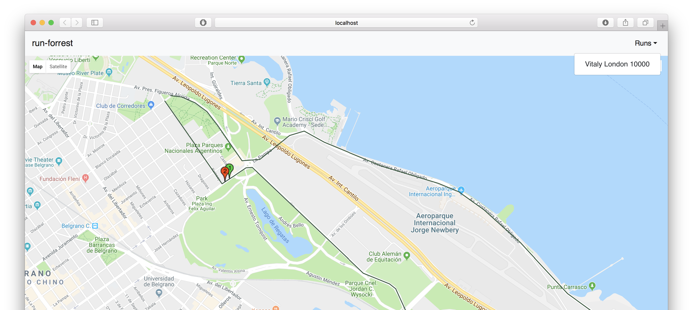

# run-forrest-server

Componentes del servidor de la app [Run Forrest](https://github.com/koba/run-forrest).

## Estructura de archivos

[admin](/admin) -> Código fuente del panel de administrador.

[backend](/backend) -> Código fuente del subsistema que provee una API REST y todas las funcionalidades necesarias para que la plataforma funcione.

